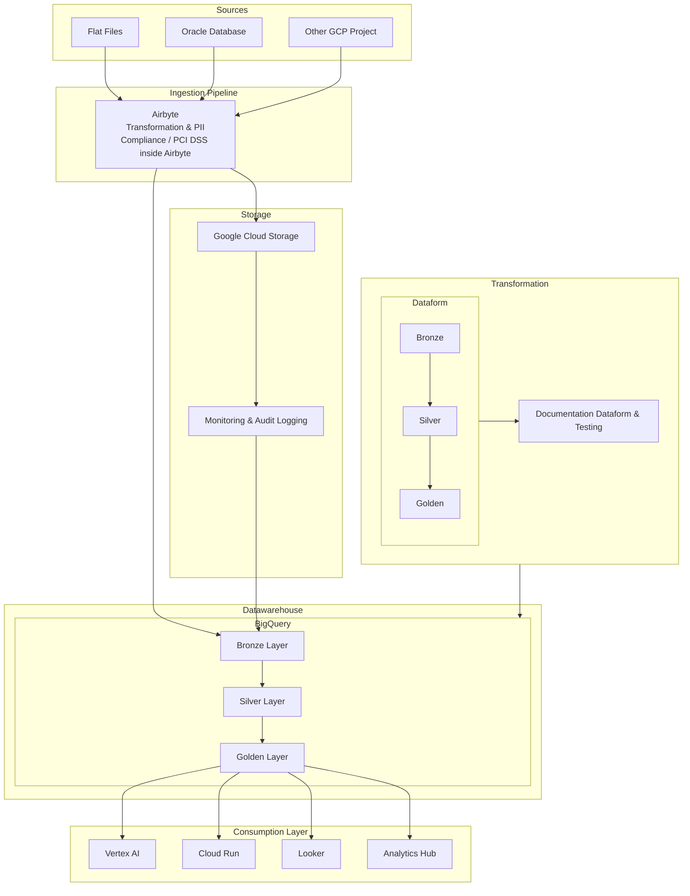

# Data Warehouse Architecture with Transformation & PII Compliance / PCI DSS via Airbyte and Dataform

This document describes a complete data pipeline architecture that extracts data from multiple sources, applies transformation and PII Compliance / PCI DSS directly within Airbyte, and then stores the transformed data in Google Cloud Storage (GCS) with Monitoring & Audit Logging. The data is then loaded into BigQuery, which organizes the data into three internal layers (Bronze, Silver, Golden). A dedicated transformation brick based on Dataform manages the promotion of data between these layers, with accompanying documentation that ensures traceability of the entire process. Finally, the Golden layer feeds downstream systems via a Consumption Layer.

---

## Architecture Overview

1. **Sources**
   Raw data is sourced from multiple origins:
   - Flat Files
   - Oracle Database
   - Other GCP Projects

2. **Ingestion Pipeline**
   - **Airbyte** extracts data from the sources and performs transformation and PII Compliance / PCI DSS within the platform or via integration with dbt.

3. **Storage & Monitoring**
   - The transformed data is stored in **Google Cloud Storage (GCS)**.
   - A **Monitoring & Audit Logging** layer tracks all storage operations to ensure compliance.

4. **Data Warehouse – BigQuery**
   - Data loaded into BigQuery is organized into three internal layers:
     - **Bronze Layer**: Raw data
     - **Silver Layer**: Cleaned and enriched data
     - **Golden Layer**: Final, curated data ready for consumption
   These layers receive data both from Storage and directly from Airbyte.

5. **Transformation – Dataform Brick with Documentation & Testing**
   - A dedicated **Transformation** brick based on **Dataform** manages the promotion of data from Bronze to Silver and from Silver to Golden.
   - The associated **Documentation & Testing (Dataform)** tracks the entire transformation process, ensuring data quality and traceability.

6. **Consumption Layer**
   - The Golden layer feeds downstream systems such as:
     - **Vertex AI**
     - **Cloud Run**
     - **Looker**
     - **Analytics Hub**

---

## Architecture Diagram

